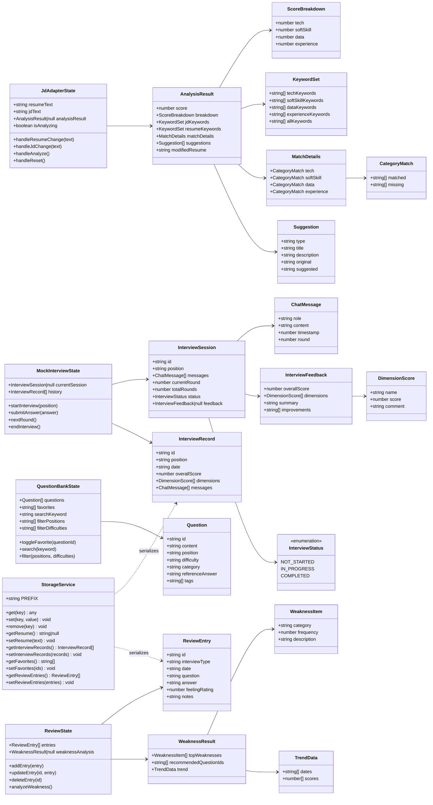
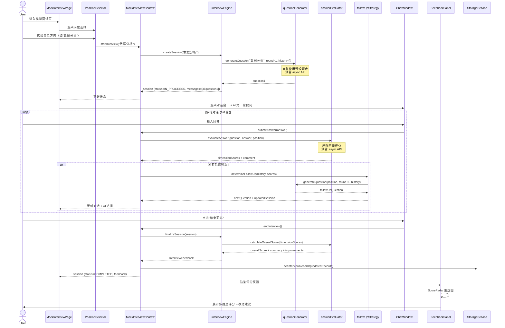
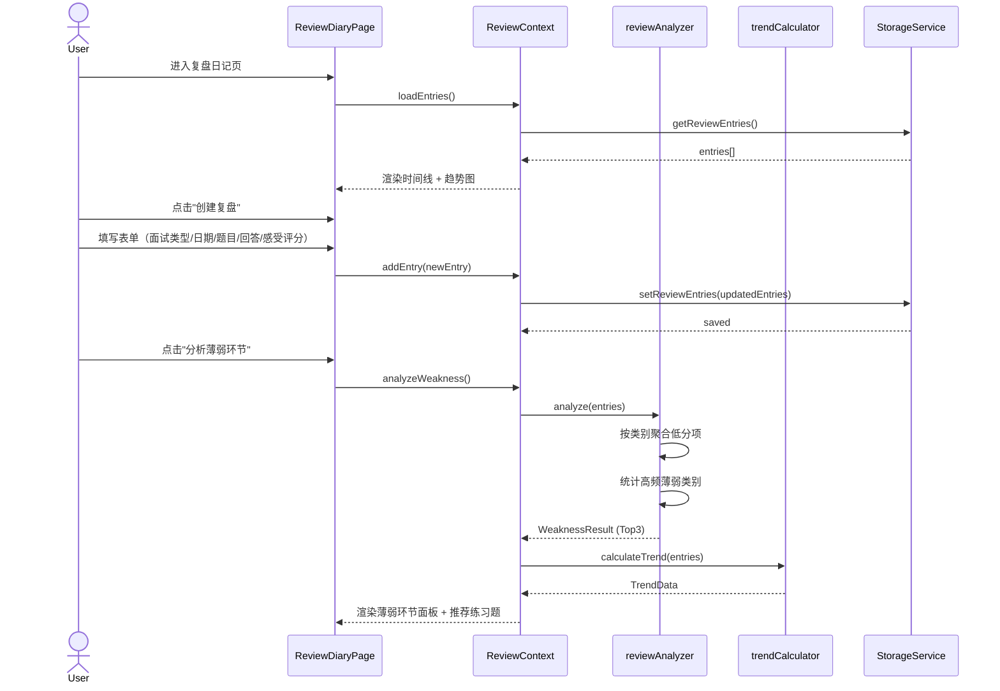
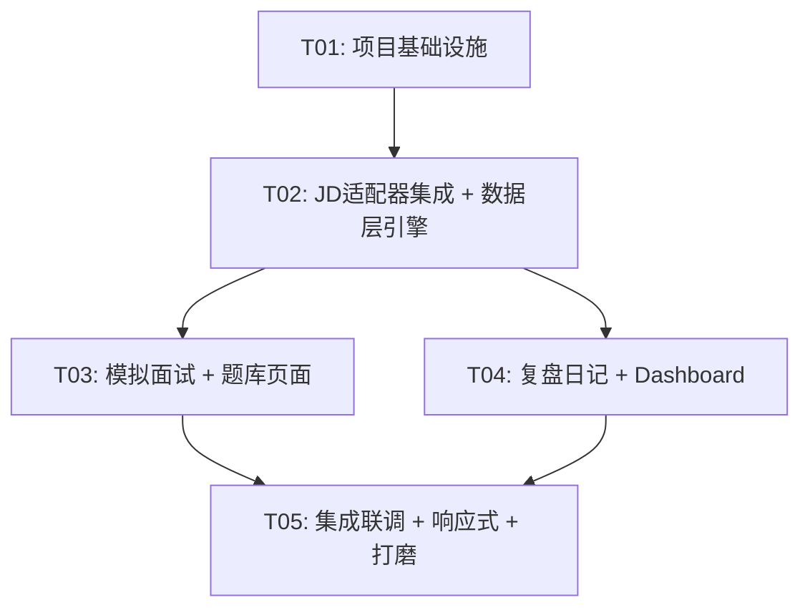

# 面面俱到 — 大学生面试备战平台 系统架构设计

> **版本**: v1.0  
> **架构师**: Bob  
> **日期**: 2026-06-17

---

## 1. 实现方案 + 框架选型

### 1.1 核心技术挑战

| 挑战 | 说明 | 应对策略 |
|------|------|----------|
| AI 模拟面试多轮对话 | 前端需管理对话状态、控制轮次、生成追问 | 预设题库 + 规则引擎 + 预留 async `generateQuestion()` / `evaluateAnswer()` 接口，当前用规则匹配模拟 |
| 多模块数据互通 | 复盘日记需引用面试记录、题库收藏、JD 适配结果 | React Context 统一状态树 + localStorage 持久化，按 `ip_` 前缀分区 |
| 已有 JD 适配器集成 | 旧模块有独立 Header/App，需融入平台布局 | 代码迁入 `src/modules/jd-adapter/`，移除独立 Header，组件保留；storage key 从 `jd-resume-adapter:` 迁移为 `ip_` 前缀 |
| 响应式布局 | 桌面侧边栏常驻 vs 移动端底部 Tab | MUI `useMediaQuery` + `Drawer` 响应式切换方案 |
| 题库 50+ 题目数据 | 前端内嵌 JSON 数据，按岗位/难度分类 | 静态 JSON + 运行时筛选/搜索，预留 async API |

### 1.2 框架选型

| 类别 | 选型 | 理由 |
|------|------|------|
| 构建工具 | Vite 5 | HMR 速度快、配置简洁、已是 JD 适配器构建工具 |
| UI 框架 | React 18 | PRD 明确指定，JD 适配器已有代码基础 |
| 组件库 | MUI v5 | PRD 明确指定，JD 适配器已大量使用 |
| CSS 方案 | Tailwind CSS（tw- 前缀） | PRD 明确指定，与 MUI sx 并行使用，Tailwind 处理布局/间距，sx 处理主题相关样式 |
| 路由 | React Router v6 | PRD 明确指定，声明式路由、嵌套布局、懒加载支持好 |
| 状态管理 | React Context + useReducer | PRD 明确指定，纯前端单用户无需 Redux，轻量够用 |
| 图表 | Recharts | 雷达图（面试评分）、趋势图（进步曲线）、轻量 React 原生 |
| 图标 | @mui/icons-material | 与 MUI 一致，JD 适配器已使用 |

### 1.3 整体架构方案

```
┌─────────────────────────────────────────────────────────┐
│                    App Shell (Layout)                     │
│  ┌──────────┐  ┌─────────────────────────────────────┐ │
│  │          │  │          Router Outlet               │ │
│  │  Drawer  │  │  ┌─────┬──────┬─────┬──────┬─────┐  │ │
│  │  (Nav)   │  │  │Dash │JDApt │Mock │Bank  │Diary│  │ │
│  │          │  │  │board│apter │Intv │      │     │  │ │
│  │          │  │  └─────┴──────┴─────┴──────┴─────┘  │ │
│  └──────────┘  └─────────────────────────────────────┘ │
│                    ↓ Context Providers ↓                  │
│  ┌─────────┐ ┌──────────┐ ┌──────────┐ ┌───────────┐  │
│  │JDAdapter│ │MockIntv  │ │Question  │ │  Review   │  │
│  │ Context │ │ Context  │ │ Context  │ │  Context  │  │
│  └────┬────┘ └────┬─────┘ └────┬─────┘ └─────┬─────┘  │
│       ↓           ↓            ↓              ↓         │
│  ┌─────────────────────────────────────────────────┐   │
│  │              localStorage (ip_ prefix)            │   │
│  └─────────────────────────────────────────────────┘   │
└─────────────────────────────────────────────────────────┘
```

**关键设计决策**：
- **模块化架构**：每个功能模块（JD适配、模拟面试、题库、复盘）有独立的 Context + 页面组件 + 引擎，松耦合
- **平台统一布局**：App Shell 提供 AppBar + Drawer/BottomNav，各模块只渲染内容区
- **预留 AI 接口**：`generateQuestion(position, round, history)` 和 `evaluateAnswer(question, answer)` 均为 async 函数，当前用本地规则实现
- **JD 适配器集成方式**：保留 `engine/` 和 `components/` 全部文件，移除 `Header.jsx`，`App.jsx` 逻辑迁入 `JdAdapterPage.jsx`，storage key 统一为 `ip_` 前缀

---

## 2. 文件列表及相对路径

```
interview-platform/
├── index.html                                  # HTML 入口
├── package.json                                # 依赖声明
├── vite.config.js                              # Vite 配置
├── tailwind.config.js                          # Tailwind 配置（tw- 前缀）
├── postcss.config.js                           # PostCSS 配置
├── jsconfig.json                               # JS 路径别名
├── public/
│   └── favicon.svg                             # 站点图标
└── src/
    ├── main.jsx                                # 应用入口：Provider 包裹 + Router
    ├── App.jsx                                  # 根组件：AppShell + Outlet
    ├── index.css                                # 全局样式 + Tailwind 指令
    │
    ├── theme/
    │   └── theme.js                             # MUI 主题定义（蓝主色 + 暖橙强调色）
    │
    ├── contexts/
    │   ├── JdAdapterContext.jsx                  # JD 适配器状态 Context
    │   ├── MockInterviewContext.jsx              # 模拟面试状态 Context
    │   ├── QuestionBankContext.jsx               # 题库状态 Context
    │   └── ReviewContext.jsx                     # 复盘日记状态 Context
    │
    ├── layouts/
    │   ├── AppShell.jsx                          # 整体布局：AppBar + Drawer + BottomNav
    │   ├── Sidebar.jsx                           # 桌面端侧边栏导航
    │   └── BottomNav.jsx                         # 移动端底部 Tab 导航
    │
    ├── pages/
    │   ├── DashboardPage.jsx                    # 首页：四宫格快捷入口 + 薄弱环节
    │   ├── JdAdapterPage.jsx                    # JD 适配页：整合旧组件
    │   ├── MockInterviewPage.jsx                # 模拟面试页：岗位选择 → 对话 → 评分
    │   ├── QuestionBankPage.jsx                 # 题库页：搜索 + 筛选 + 卡片列表
    │   └── ReviewDiaryPage.jsx                  # 复盘日记页：时间线 + 趋势 + 创建
    │
    ├── modules/
    │   ├── jd-adapter/                           # JD 适配器模块（迁入）
    │   │   ├── components/
    │   │   │   ├── ResumeInput.jsx               # 简历输入（保留）
    │   │   │   ├── JDInput.jsx                   # JD 输入（保留）
    │   │   │   ├── AnalysisResult.jsx            # 分析结果（保留）
    │   │   │   ├── SuggestionCard.jsx             # 建议卡片（保留）
    │   │   │   └── ScoreGauge.jsx                # 评分仪表盘（保留）
    │   │   └── engine/
    │   │       ├── analyzer.js                   # 分析引擎入口（保留）
    │   │       ├── keywordExtractor.js            # 关键词提取（保留）
    │   │       ├── matcher.js                     # 匹配度计算（保留）
    │   │       ├── suggestionGenerator.js         # 建议生成（保留）
    │   │       └── keywords.js                    # 关键词库（保留）
    │   │
    │   ├── mock-interview/                       # 模拟面试模块
    │   │   ├── components/
    │   │   │   ├── PositionSelector.jsx           # 岗位方向选择
    │   │   │   ├── ChatWindow.jsx                 # 对话窗口
    │   │   │   ├── ChatBubble.jsx                 # 单条消息气泡
    │   │   │   ├── InterviewControls.jsx          # 面试控制（开始/结束/下一轮）
    │   │   │   ├── ScoreRadar.jsx                 # 评分雷达图
    │   │   │   └── FeedbackPanel.jsx              # 反馈面板
    │   │   └── engine/
    │   │       ├── interviewEngine.js             # 面试流程控制器
    │   │       ├── questionGenerator.js           # 题目生成（预设 + 预留 async）
    │   │       ├── answerEvaluator.js             # 回答评估（规则匹配 + 预留 async）
    │   │       └── followUpStrategy.js            # 追问策略
    │   │
    │   ├── question-bank/                        # 题库模块
    │   │   ├── components/
    │   │   │   ├── QuestionCard.jsx               # 题目卡片
    │   │   │   ├── QuestionFilter.jsx             # Chip 筛选栏
    │   │   │   ├── SearchBar.jsx                   # 搜索栏
    │   │   │   └── AnswerDialog.jsx               # 参考答案弹窗
    │   │   ├── data/
    │   │   │   └── questions.json                 # 50+ 题目静态数据
    │   │   └── engine/
    │   │       └── questionSearch.js             # 搜索 + 筛选逻辑
    │   │
    │   └── review/                               # 复盘日记模块
    │       ├── components/
    │       │   ├── ReviewTimeline.jsx             # 时间线视图
    │       │   ├── ReviewForm.jsx                 # 复盘创建/编辑表单
    │       │   ├── TrendChart.jsx                 # 进步趋势图
    │       │   ├── WeaknessAnalysis.jsx           # 薄弱环节分析面板
    │       │   └── FeelingRating.jsx              # 感受评分组件
    │       └── engine/
    │           ├── reviewAnalyzer.js             # 薄弱环节分析引擎
    │           └── trendCalculator.js             # 趋势计算
    │
    ├── shared/
    │   ├── storage.js                            # localStorage 统一封装（ip_ 前缀）
    │   ├── constants.js                          # 全局常量：岗位方向、难度等级等
    │   └── hooks/
    │       ├── useLocalStorage.js                 # localStorage 响应式 Hook
    │       └── useMediaQuery.js                   # 响应式断点 Hook
    │
    └── router/
        └── index.jsx                             # 路由配置
```

---

## 3. 数据结构和接口（类图）



---

## 4. 程序调用流程（时序图）

### 4.1 模拟面试核心流程



### 4.2 复盘薄弱环节分析流程



---

## 5. 任务列表

### 依赖包列表

```
- react@^18.2.0: UI 框架
- react-dom@^18.2.0: React DOM 渲染
- react-router-dom@^6.20.0: 路由管理
- @mui/material@^5.15.0: MUI 组件库
- @mui/icons-material@^5.15.0: MUI 图标库
- @emotion/react@^11.11.0: MUI 样式引擎
- @emotion/styled@^11.11.0: MUI 样式引擎
- recharts@^2.10.0: 图表库（雷达图、趋势图）
- tailwindcss@^3.4.0: 原子化 CSS
- postcss@^8.4.0: CSS 处理
- autoprefixer@^10.4.0: CSS 自动前缀
- @vitejs/plugin-react@^4.2.0: Vite React 插件
- vite@^5.0.0: 构建工具
```

### 任务详情

#### T01: 项目基础设施

- **任务名称**: 项目基础设施搭建（配置 + 入口 + 布局 + 路由 + 主题 + 存储）
- **依赖**: 无
- **优先级**: P0
- **涉及文件**:
  - `package.json` — 依赖声明与脚本
  - `vite.config.js` — Vite 配置（路径别名、代理）
  - `tailwind.config.js` — Tailwind 配置（tw- 前缀、content 路径）
  - `postcss.config.js` — PostCSS 插件配置
  - `jsconfig.json` — JS 路径别名
  - `index.html` — HTML 入口
  - `public/favicon.svg` — 站点图标
  - `src/main.jsx` — 应用入口（Provider 栈 + Router）
  - `src/App.jsx` — 根组件（AppShell + Outlet）
  - `src/index.css` — 全局样式 + Tailwind 指令
  - `src/theme/theme.js` — MUI 主题（蓝主色 + 暖橙强调色）
  - `src/shared/storage.js` — localStorage 统一封装（ip_ 前缀）
  - `src/shared/constants.js` — 全局常量（岗位方向、难度等级）
  - `src/shared/hooks/useLocalStorage.js` — localStorage 响应式 Hook
  - `src/shared/hooks/useMediaQuery.js` — 响应式断点 Hook
  - `src/layouts/AppShell.jsx` — 整体布局（AppBar + Drawer + BottomNav）
  - `src/layouts/Sidebar.jsx` — 桌面端侧边栏
  - `src/layouts/BottomNav.jsx` — 移动端底部 Tab
  - `src/router/index.jsx` — 路由配置（懒加载各页面）
  - `src/contexts/JdAdapterContext.jsx` — JD 适配器 Context（仅骨架）
  - `src/contexts/MockInterviewContext.jsx` — 模拟面试 Context（仅骨架）
  - `src/contexts/QuestionBankContext.jsx` — 题库 Context（仅骨架）
  - `src/contexts/ReviewContext.jsx` — 复盘 Context（仅骨架）
- **描述**: 创建项目脚手架，安装全部依赖，配置 Vite/Tailwind/PostCSS/路径别名。搭建 AppShell 布局（AppBar + 响应式导航），配置 React Router 路由表（6 个路由对应 6 个页面，暂用占位组件），创建 MUI 主题（蓝主色 + 暖橙强调色），实现 localStorage 统一封装和响应式 Hook，创建 4 个模块 Context 的骨架结构（仅 state + reducer 框架，不含业务逻辑）。

#### T02: JD 适配器集成 + 题库数据层

- **任务名称**: JD 适配器迁入 + 题库静态数据 + 各模块引擎
- **依赖**: T01
- **优先级**: P0
- **涉及文件**:
  - `src/modules/jd-adapter/components/ResumeInput.jsx` — 简历输入（迁入，保留）
  - `src/modules/jd-adapter/components/JDInput.jsx` — JD 输入（迁入，保留）
  - `src/modules/jd-adapter/components/AnalysisResult.jsx` — 分析结果（迁入，保留）
  - `src/modules/jd-adapter/components/SuggestionCard.jsx` — 建议卡片（迁入，保留）
  - `src/modules/jd-adapter/components/ScoreGauge.jsx` — 评分仪表盘（迁入，保留）
  - `src/modules/jd-adapter/engine/analyzer.js` — 分析引擎（迁入，保留）
  - `src/modules/jd-adapter/engine/keywordExtractor.js` — 关键词提取（迁入，保留）
  - `src/modules/jd-adapter/engine/matcher.js` — 匹配度计算（迁入，保留）
  - `src/modules/jd-adapter/engine/suggestionGenerator.js` — 建议生成（迁入，保留）
  - `src/modules/jd-adapter/engine/keywords.js` — 关键词库（迁入，保留）
  - `src/pages/JdAdapterPage.jsx` — JD 适配页面（整合旧组件，替代旧 App.jsx）
  - `src/contexts/JdAdapterContext.jsx` — JD 适配器 Context（补全业务逻辑）
  - `src/modules/question-bank/data/questions.json` — 50+ 题目静态数据
  - `src/modules/question-bank/engine/questionSearch.js` — 搜索筛选逻辑
  - `src/modules/mock-interview/engine/interviewEngine.js` — 面试流程控制器
  - `src/modules/mock-interview/engine/questionGenerator.js` — 题目生成（预设 + 预留 async）
  - `src/modules/mock-interview/engine/answerEvaluator.js` — 回答评估（规则匹配 + 预留 async）
  - `src/modules/mock-interview/engine/followUpStrategy.js` — 追问策略
  - `src/modules/review/engine/reviewAnalyzer.js` — 薄弱环节分析引擎
  - `src/modules/review/engine/trendCalculator.js` — 趋势计算
  - `src/shared/constants.js` — 补充题库相关常量
- **描述**: 将 JD 适配器的 components/ 和 engine/ 全部迁入新项目目录，创建 JdAdapterPage.jsx 替代原 App.jsx（移除独立 Header，使用平台布局），将 storage key 从 `jd-resume-adapter:` 更新为 `ip_` 前缀。编写 50+ 道面试题静态 JSON 数据（按岗位方向和难度分类）。实现所有模块的 engine 层：模拟面试引擎（流程控制 + 题目生成 + 回答评估 + 追问策略）、题库搜索引擎、复盘分析引擎（薄弱环节识别 + 趋势计算）。补全 JdAdapterContext 业务逻辑。

#### T03: 核心业务页面 — 模拟面试 + 题库

- **任务名称**: 模拟面试页面组件 + 题库页面组件
- **依赖**: T02
- **优先级**: P0
- **涉及文件**:
  - `src/pages/MockInterviewPage.jsx` — 模拟面试页面
  - `src/modules/mock-interview/components/PositionSelector.jsx` — 岗位方向选择
  - `src/modules/mock-interview/components/ChatWindow.jsx` — 对话窗口
  - `src/modules/mock-interview/components/ChatBubble.jsx` — 单条消息气泡
  - `src/modules/mock-interview/components/InterviewControls.jsx` — 面试控制
  - `src/modules/mock-interview/components/ScoreRadar.jsx` — 评分雷达图
  - `src/modules/mock-interview/components/FeedbackPanel.jsx` — 反馈面板
  - `src/contexts/MockInterviewContext.jsx` — 模拟面试 Context（补全业务逻辑）
  - `src/pages/QuestionBankPage.jsx` — 题库页面
  - `src/modules/question-bank/components/QuestionCard.jsx` — 题目卡片
  - `src/modules/question-bank/components/QuestionFilter.jsx` — Chip 筛选栏
  - `src/modules/question-bank/components/SearchBar.jsx` — 搜索栏
  - `src/modules/question-bank/components/AnswerDialog.jsx` — 参考答案弹窗
  - `src/contexts/QuestionBankContext.jsx` — 题库 Context（补全业务逻辑）
- **描述**: 实现模拟面试完整交互流程：岗位选择 → AI 提问 → 用户回答 → AI 追问（3-8 轮）→ 结束面试 → 多维度评分雷达图 + 改进建议。实现题库浏览：搜索栏 + Chip 筛选（岗位/难度）+ 卡片列表 + 收藏/取消 + 查看参考答案弹窗。补全 MockInterviewContext 和 QuestionBankContext 的完整业务逻辑。

#### T04: 复盘日记 + 首页 Dashboard

- **任务名称**: 复盘日记页面 + Dashboard 页面
- **依赖**: T02
- **优先级**: P0
- **涉及文件**:
  - `src/pages/ReviewDiaryPage.jsx` — 复盘日记页面
  - `src/modules/review/components/ReviewTimeline.jsx` — 时间线视图
  - `src/modules/review/components/ReviewForm.jsx` — 复盘创建/编辑表单
  - `src/modules/review/components/TrendChart.jsx` — 进步趋势图
  - `src/modules/review/components/WeaknessAnalysis.jsx` — 薄弱环节分析面板
  - `src/modules/review/components/FeelingRating.jsx` — 感受评分组件
  - `src/contexts/ReviewContext.jsx` — 复盘 Context（补全业务逻辑）
  - `src/pages/DashboardPage.jsx` — 首页 Dashboard
- **描述**: 实现复盘日记完整功能：时间线视图展示历史记录、创建复盘表单（面试类型/日期/题目/回答/感受评分 1-5）、薄弱环节 Top3 分析面板 + 推荐练习题、进步趋势折线图。实现首页 Dashboard：四宫格快捷入口（JD 适配/模拟面试/题库/复盘日记）+ 薄弱环节小组件（复用 WeaknessAnalysis）+ 最近活动列表。补全 ReviewContext 完整业务逻辑。

#### T05: 集成联调 + 响应式适配 + 细节打磨

- **任务名称**: 全局集成 + 响应式 + 交互细节 + 最终验证
- **依赖**: T03, T04
- **优先级**: P0
- **涉及文件**:
  - `src/main.jsx` — 调整 Provider 顺序和懒加载
  - `src/App.jsx` — 最终集成调试
  - `src/layouts/AppShell.jsx` — 响应式细节打磨
  - `src/layouts/Sidebar.jsx` — 侧边栏活跃项高亮
  - `src/layouts/BottomNav.jsx` — 移动端适配
  - `src/index.css` — 全局样式微调
  - `src/pages/DashboardPage.jsx` — 数据联动验证
  - `src/pages/MockInterviewPage.jsx` — 面试记录 → 复盘联动
  - `src/pages/ReviewDiaryPage.jsx` — 复盘推荐题目跳转题库
  - `src/shared/storage.js` — 数据迁移兼容处理
  - `src/contexts/MockInterviewContext.jsx` — 面试记录自动同步到复盘(P1-03预埋)
- **描述**: 全局集成联调：确保各模块路由切换正常、Context 状态正确持久化到 localStorage、跨模块数据流通（模拟面试结束自动创建复盘记录、薄弱环节推荐题跳转题库、首页展示真实数据）。响应式适配：桌面端侧边栏常驻 + 移动端底部 Tab 切换、对话窗口在移动端全屏、表格/图表响应式。交互细节：加载态、空状态、错误提示、Snackbar 反馈、页面过渡动画。最终端到端验证所有 P0 功能。

---

### 任务依赖图



---

## 6. 共享知识

### 6.1 命名规范

| 类别 | 规范 | 示例 |
|------|------|------|
| 文件名 | PascalCase（组件）、camelCase（引擎/工具） | `ChatWindow.jsx`、`answerEvaluator.js` |
| 目录名 | kebab-case | `mock-interview/`、`question-bank/` |
| CSS 类名 | `tw-` 前缀 Tailwind 类 | `tw-flex tw-items-center` |
| Context 命名 | `{Module}Context` | `MockInterviewContext` |
| localStorage key | `ip_` 前缀 + 下划线分隔 | `ip_resume`、`ip_interview_records` |

### 6.2 localStorage Key 规范

| Key | 类型 | 说明 |
|-----|------|------|
| `ip_resume` | string | 最近使用的简历文本 |
| `ip_jd` | string | 最近使用的 JD 文本 |
| `ip_interview_records` | JSON string | 模拟面试历史记录数组 |
| `ip_favorites` | JSON string | 收藏题目 ID 数组 |
| `ip_review_entries` | JSON string | 复盘日记条目数组 |

### 6.3 状态管理方案

- 使用 React Context + useReducer，每个模块独立 Context
- Provider 嵌套顺序（从外到内）：`JdAdapterProvider` → `MockInterviewProvider` → `QuestionBankProvider` → `ReviewProvider`
- 所有 localStorage 读写通过 `shared/storage.js` 统一处理，禁止组件直接调用 `localStorage`
- 使用 `useLocalStorage` Hook 实现状态初始化 + 自动持久化

### 6.4 路由方案

| 路径 | 页面 | 导航标签 |
|------|------|----------|
| `/` | DashboardPage | 首页 |
| `/jd-adapter` | JdAdapterPage | JD 适配 |
| `/mock-interview` | MockInterviewPage | 模拟面试 |
| `/question-bank` | QuestionBankPage | 题库 |
| `/review-diary` | ReviewDiaryPage | 复盘日记 |

- 使用 React Router v6 `<Outlet>` 嵌套布局
- 各页面使用 `React.lazy()` 懒加载
- `Navigate` 组件重定向 `/` 到 Dashboard

### 6.5 样式约定

- **布局/间距**: 优先使用 Tailwind 类（`tw-flex tw-gap-4 tw-p-6`）
- **主题/颜色/组件样式**: 使用 MUI `sx` prop
- **Tailwind 前缀**: `tw-`，避免与 MUI 类名冲突
- **主色调**: `#1976d2`（蓝），强调色: `#ff6d00`（暖橙）

### 6.6 预留 AI 接口

```javascript
// questionGenerator.js
export async function generateQuestion(position, round, history) {
  // 当前：从预设题库匹配
  // 未来：await fetch('/api/generate-question', { ... })
}

// answerEvaluator.js
export async function evaluateAnswer(question, answer, position) {
  // 当前：规则匹配（关键词命中 + 长度 + 结构）
  // 未来：await fetch('/api/evaluate-answer', { ... })
}
```

### 6.7 岗位方向常量

```javascript
export const POSITIONS = [
  { id: 'data-analyst', label: '数据分析', icon: 'BarChartIcon' },
  { id: 'product-ops', label: '产品运营', icon: 'CampaignIcon' },
  { id: 'business-analysis', label: '商业分析', icon: 'BusinessCenterIcon' },
  { id: 'data-engineering', label: '数据开发', icon: 'StorageIcon' },
  { id: 'management-trainee', label: '管培生', icon: 'SchoolIcon' },
];
```

---

## 7. 待明确事项

| # | 问题 | 影响 | 假设/建议 |
|---|------|------|-----------|
| 1 | 50+ 道面试题的具体内容和分类标准 | 题库模块数据质量 | 假设按5个岗位方向各10+题，每题标注 easy/medium/hard，由工程师基于常见面试题编写 |
| 2 | AI 评估回答的具体规则维度和权重 | 模拟面试评分准确性 | 假设3个维度：回答质量(0.4)、逻辑性(0.3)、表达清晰度(0.3)，规则匹配基于关键词覆盖率 + 文本长度 + 结构性词汇 |
| 3 | 复盘日记"面试类型"选项列表 | 表单设计 | 假设包含：技术面试、行为面试、案例面试、综合面试 |
| 4 | P1-03（面试记录自动同步到复盘日记）是否纳入 MVP | T05 任务范围 | 建议在 T05 中预埋接口和数据结构，正式实现放到 P1 迭代 |
| 5 | 移动端断点具体取值 | 响应式布局 | 假设 `md`(960px) 以下为移动端，显示底部 Tab；以上显示侧边栏 |
| 6 | Dashboard "薄弱环节小组件" 数据来源 | Dashboard 设计 | 假设复用 ReviewContext 的 `analyzeWeakness()` 结果，若无复盘数据则显示引导文案 |
